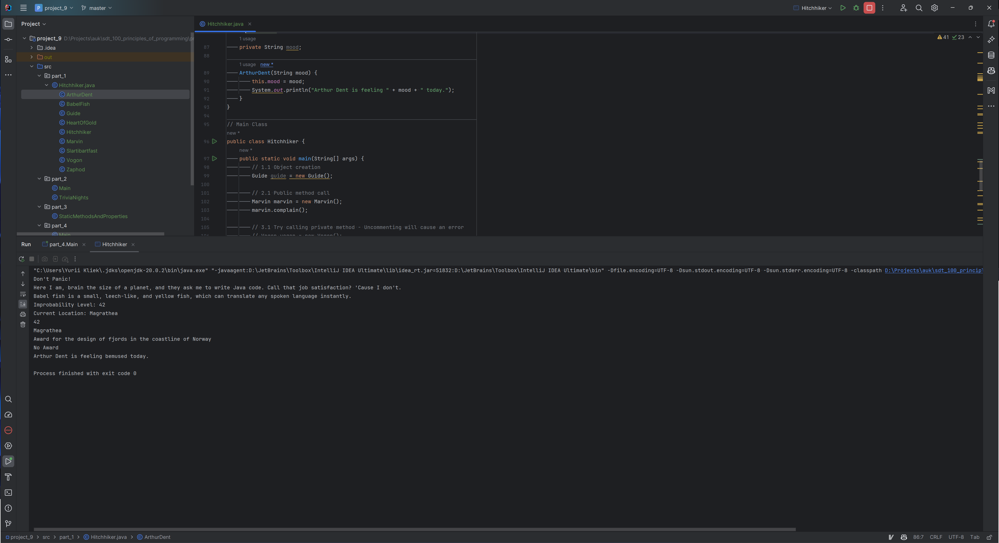
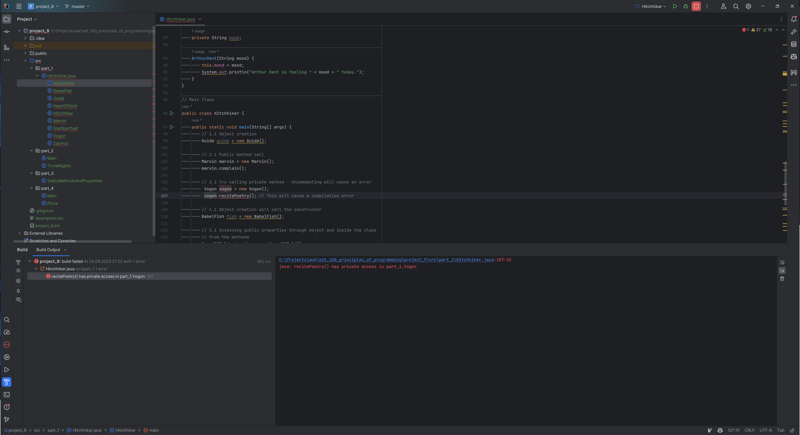
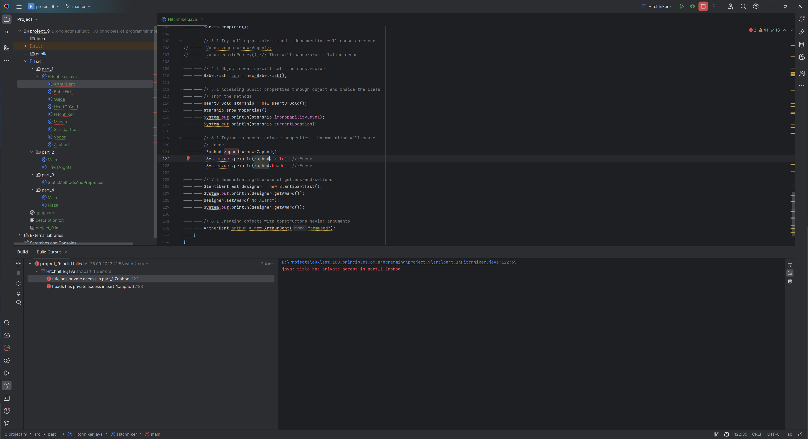
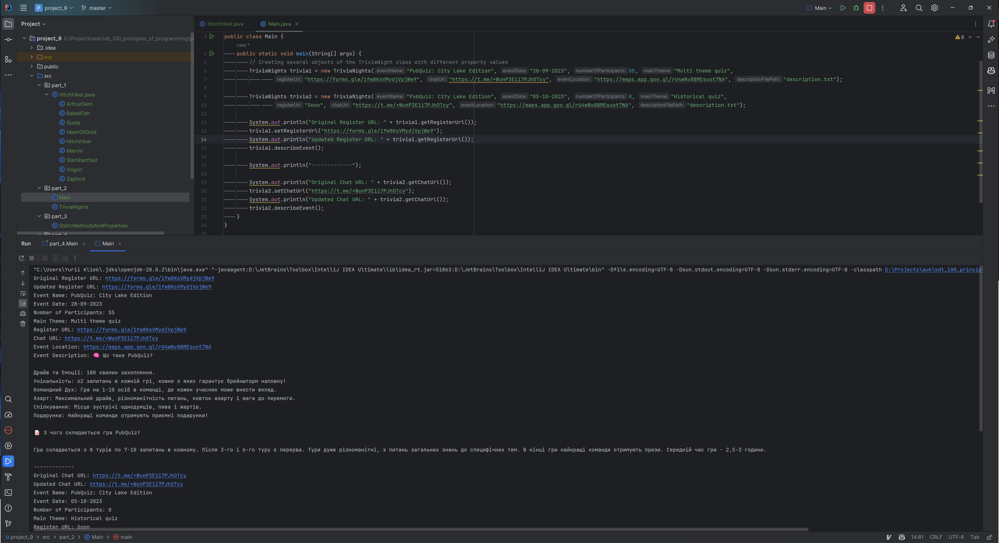
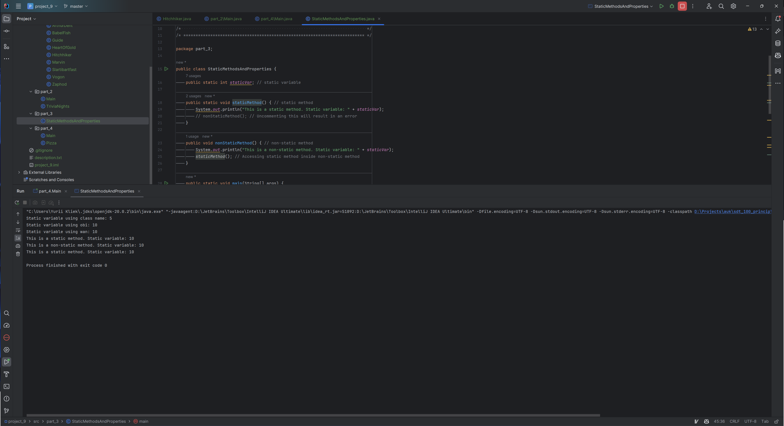
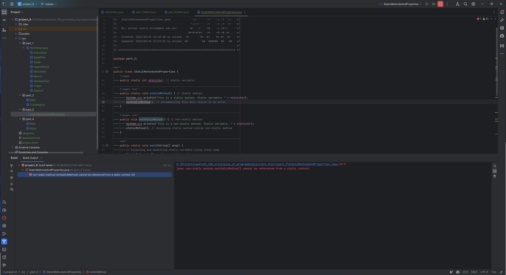
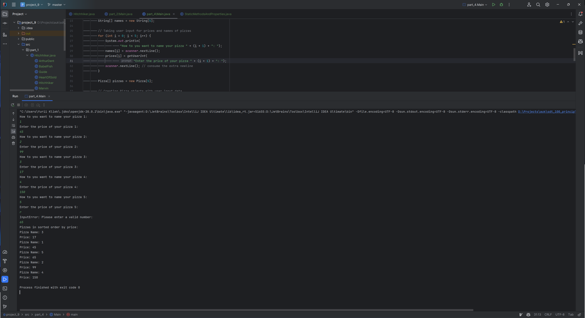

# UK SDT 100: Principles of Programming FA23: Project 9. Classes and objects

A series of Java projects demonstrating various programming techniques and best practices.

## Table of Contents

- [File Structure](#file-structure)
- [Part 1: Hitchhiker's Guide to OOP](#part-1-hitchhikers-guide-to-oop)
- [Part 2: Trivia Night Class Demonstration](#part-2-trivia-night-class-demonstration)
- [Part 3: Static Methods and Properties](#part-3-static-methods-and-properties)
- [Part 4: Pizza Class Demonstration](#part-4-pizza-class-demonstration)

## File Structure

<pre>
project_9
│
├── public
│   └── static
│       └── [screenshots]
│
├── src
│   ├── part_1
│   │   └── Hitchhiker.java
│   │
│   ├── part_2
│   │   ├── Main.java
│   │   └── TriviaNights.java
│   │
│   ├── part_3
│   │   └── StaticMethodsAndProperties.java
│   │
│   └── part_4
│       ├── Main.java
│       └── TriviaNights.java
│
├── .gitignore
├── README.md
├── description.txt
└── project_9.iml
</pre>

# Part 1: Hitchhiker's Guide to OOP
In this part, we are demonstrating various fundamental concepts of Object-Oriented Programming (OOP) with classes, constructors, public and private properties, and methods.

Demonstrate a class with a private method. Try to call it outside the class for an object. Make a screenshot of the error message.

Demonstrate a class with a private method. Try to call it outside the class for an object. Make a screenshot of the error message.

# Part 2: Trivia Night Class Demonstration

## Introduction
This README outlines the creation and usage of the `TriviaNight` class, which is an artifact representing the hobby of organizing Trivia Nights.

## Features
1. The class encompasses properties such as register URL, chat URL, event location, and an event description.
2. The event description can be read from a file.
3. It contains getter and setter methods for most of its properties.

## How to Use
1. Create an instance of the `TriviaNight` class.
2. Set values using the setters and retrieve values using the getters.
3. Use the `describeEvent` method to get a complete description of the event.

## Screenshots

# Part 3: Static Methods and Properties

In this part, the use of static variables and methods is demonstrated along with their accessibility and limitations.

Try to access non-static method inside the static method of the same class. Notice the error.

# Part 4: Pizza Class Demonstration

## Introduction
This README describes the creation and functionalities of the `Pizza` class, which represents a pizza with attributes like price and name.

## Features
1. Create a pizza with specific name and price.
2. Generate a pizza information string using a method.
3. Sort an array of pizzas based on their price.

## How to Use
1. Input names and prices for five pizzas.
2. View the sorted list of pizzas by price.
3. Retrieve pizza information using the `getPizzaInfo` method.

## Screenshots

